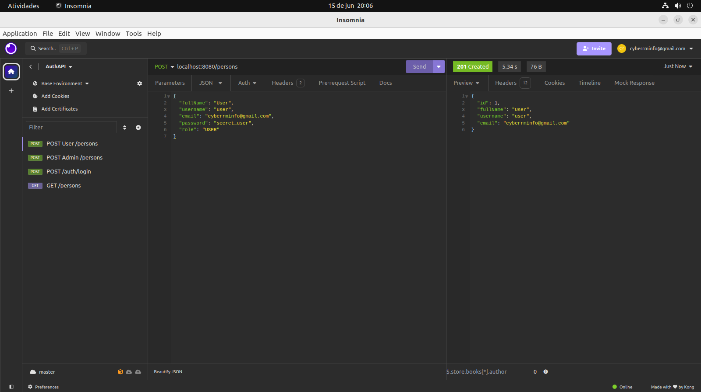

# Authentication API

This project is an Authentication API built using Java and the Spring Boot framework.
It provides endpoints for user authentication, profile management, and token-based
authorization using JSON Web Tokens (JWT). Additionally, the API includes functionality
to send emails, such as welcome emails upon successful user registration.

## Technologies Used

- Java: Programming language used for backend development.

- Spring Boot: Framework for building Java applications, providing features like dependency injection, web services, and security.

- Spring Security: Provides authentication and access control features for securing Spring-based applications.

- JWT (JSON Web Tokens): Token-based authentication mechanism for securely transmitting information between parties as JSON objects.

- Hibernate Validator: Implementation of the Bean Validation API for validating user input.

- Spring Data JPA: Simplifies data access for relational databases in Spring applications.

- H2 Database: Lightweight in-memory database used for development and testing purposes.

## Features

- User authentication with username and password.

- Token-based authorization for protected endpoints.

- CRUD operations for user profiles.

- Role-based access control (RBAC) with ADMIN and MANAGER roles.

## Usage
  
- Authentication:
    - Endpoint: POST /auth/login
    - Payload: { "username": "example", "password": "password" }


- User Profile Management:
    - Create User: POST /persons
    - Get All Users: GET /persons
    - Get User by ID: GET /persons/{id}

## Getting Started

1. Clone the repository:
```
git clone https://github.com/your-username/authentication-api.git
```

2. Build the project:
```
cd authentication-api
mvn clean install
```

3. Run the application:
```
mvn spring-boot:run
```

4. Access the API:
```
Base URL: http://localhost:8080
```

## ScreenShots

### Register user


### Authenticate user

