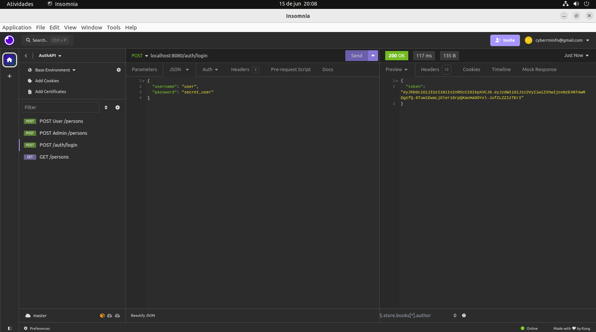
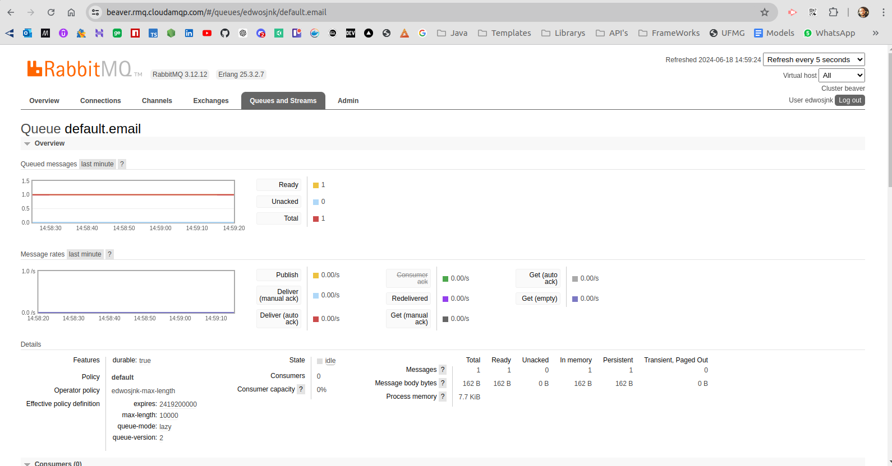
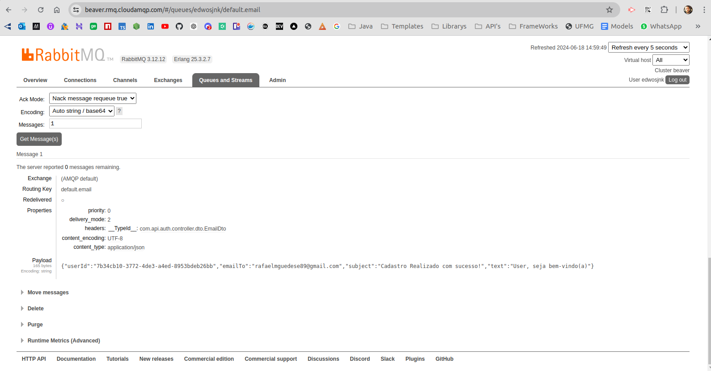
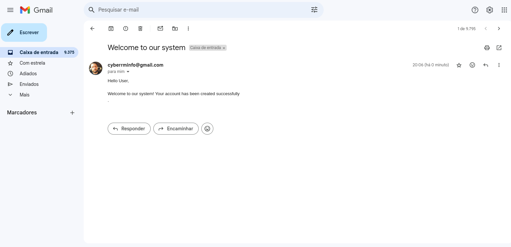

# Sistema de Autenticação com JWT e RabbitMQ

## Visão Geral
AuthRabbit é um sistema de autenticação que utiliza JSON Web Tokens (JWT) para autenticação
e RabbitMQ para envio de emails. Ele foi desenvolvido usando Spring Boot e segue a arquitetura
de microserviços, dividindo a funcionalidade de autenticação e envio de emails em serviços
independentes. Este sistema inclui as seguintes funcionalidades:

- Registro de novos usuários

- Autenticação de usuários

- Geração e verificação de tokens JWT

- Envio de emails de boas-vindas utilizando RabbitMQ

- Integração com CloudAMQP para gerenciamento de mensagens RabbitMQ na nuvem


## Requisitos

- Java 17 ou superior

- Maven 3.8 ou superior

- Conta no CloudAMQP


## Configuração do Ambiente

1. Clone o Repositório
```
git clone https://github.com/seu-usuario/seu-repositorio.git
cd seu-repositorio
```
2. Configure o CloudAMQP
   Certifique-se de que você tem uma conta no CloudAMQP e crie uma instância do RabbitMQ. Você pode se registrar e configurar sua instância no CloudAMQP.

3. Configuração do Banco de Dados
   Certifique-se de que você tem um banco de dados configurado e atualize as configurações de conexão no arquivo application.properties.

4. Configure as Propriedades do Aplicativo
   Edite o arquivo src/main/resources/application.properties com as configurações do seu ambiente.

## Estrutura do Projeto

### Pacotes Principais

- controller: Contém os controladores REST que lidam com as requisições HTTP.

- dto: Contém as classes Data Transfer Objects (DTO) para transferência de dados.

- entity: Contém as entidades JPA que representam as tabelas do banco de dados.

- producers: Contém as classes responsáveis pelo envio de mensagens para o RabbitMQ.

- consumers: Contém as classes que consomem mensagens do RabbitMQ.

- security: Contém as configurações de segurança e classes relacionadas ao JWT.

## Arquitetura de Microserviços

### Microserviço de Autenticação

O microserviço de autenticação é responsável pelo registro e autenticação dos usuários,
bem como pela geração e verificação de tokens JWT. Ele expõe endpoints REST para essas
funcionalidades e publica eventos de cadastro de novos usuários na fila RabbitMQ.

### Microserviço de Envio de Email

O microserviço de envio de email consome eventos da fila RabbitMQ e envia emails de boas-vindas
para os novos usuários. Ele escuta a fila configurada e utiliza as informações dos eventos para
compor e enviar os emails.

## Como Executar

1. ***Certifique-se de que o RabbitMQ e o banco de dados estão em execução.***
2. Compile e execute o projeto:
```
   mvn clean install
   mvn spring-boot:run
```
3. O servidor estará disponível em http://localhost:8081.

## Endpoints

### Autenticação

- POST /auth/login: Autenticação de um usuário e geração de token JWT.

### Usuário

- POST /persons: Registro de um novo usuário.

- GET /persons: Obter informações do usuário autenticado (requer token JWT).

## Prints do fluxo

### Registrar usuário


### Autenticação



### Email recebido na fila da cloud



### Payload do Email recebido



### Email enviado ao usuário


